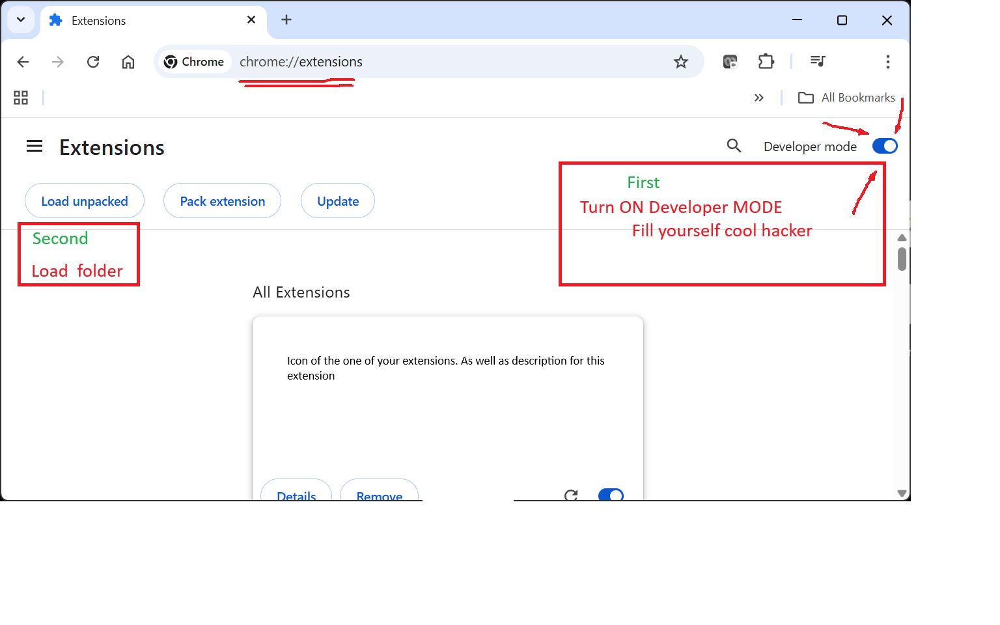
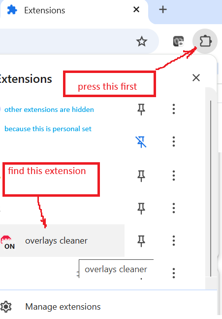
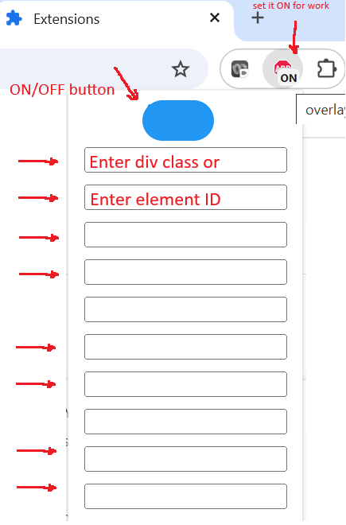

# google chrome overlay cleaner

**Purpose**: It closes popup windows in Google Chrome according manual settings

**Problem statement**: A site uses annoyng popup window and asks your consent about what ever: license, awareness, agreement etc. But I do not care. I just need something under the popup

## Manual actions
1. Open Google Chrome developer tool kit. `Ctrl + Shift + I`
1. two options: {use search tool `Ctrl + Shift + C`}
    - find main \<div\> of overlay window
    - find element
1. Delete it from the page
1. Enjoy!

## Automatic actions
1. (can be ignored) Review the code of the plugin - for safety reasons. For fun
2. Install extention from **~\CHROME_EXT\src** folder

  

3. Turn extension ON

  

4. Set class ID of annoying div in the extention or. Set element ID of annoying something

  

5. Enjoy!

**PS.** Sorry, Only 10 lines being supported at the moment
